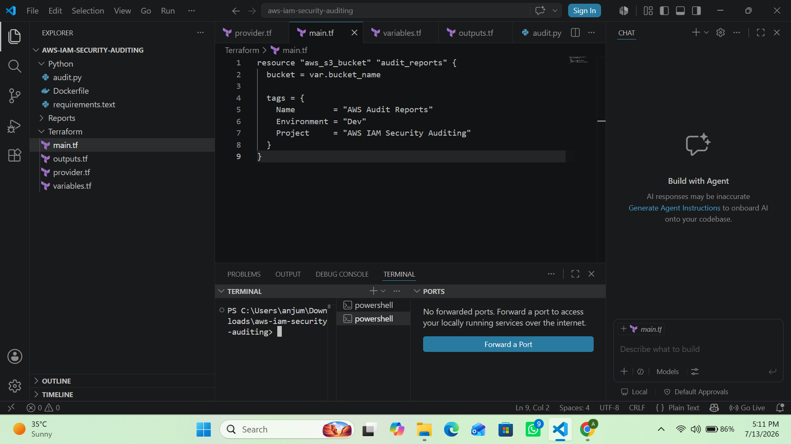
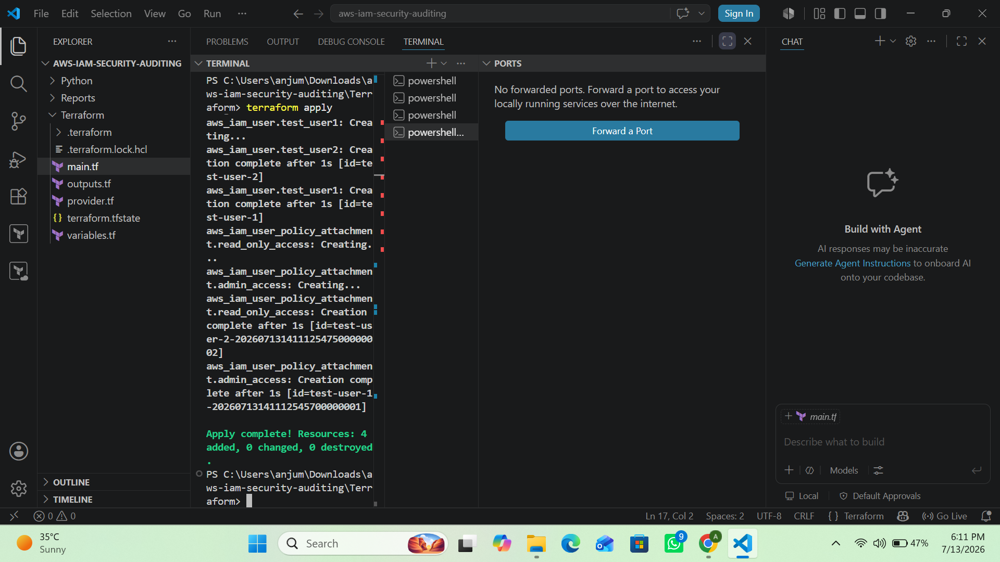
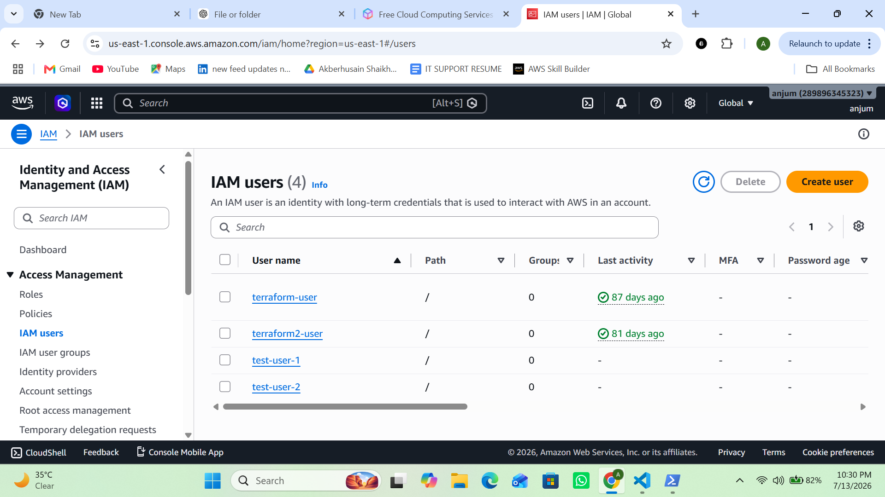
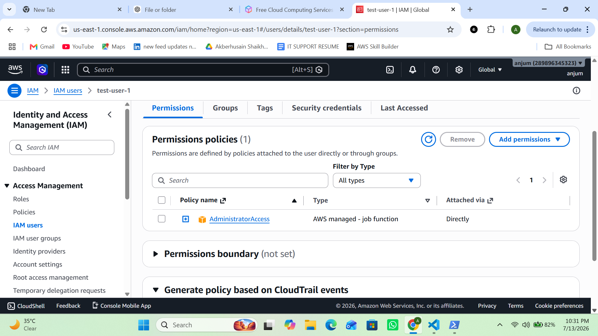
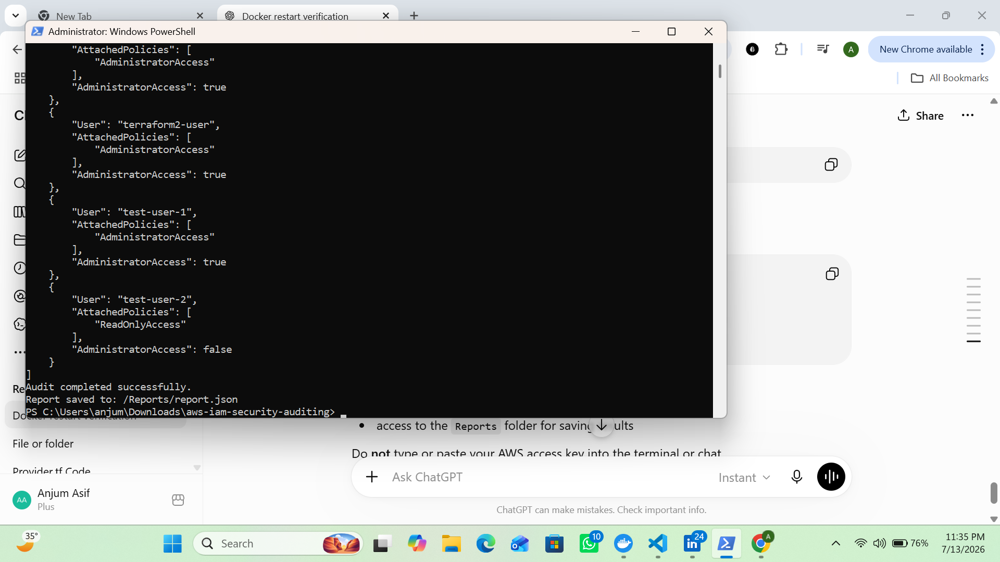
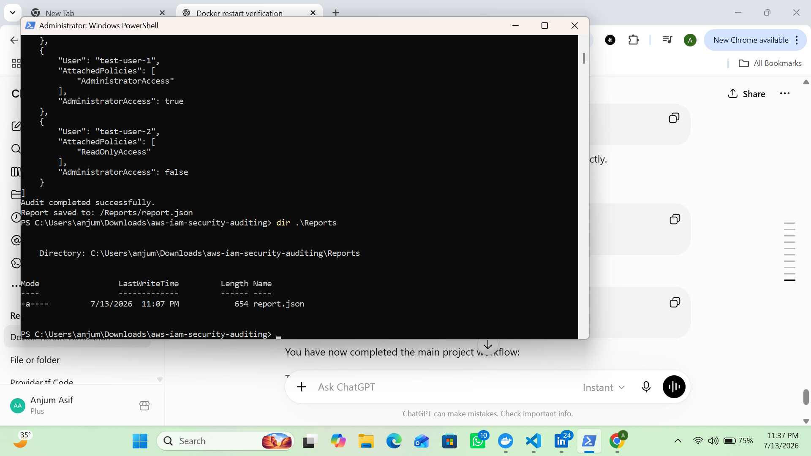
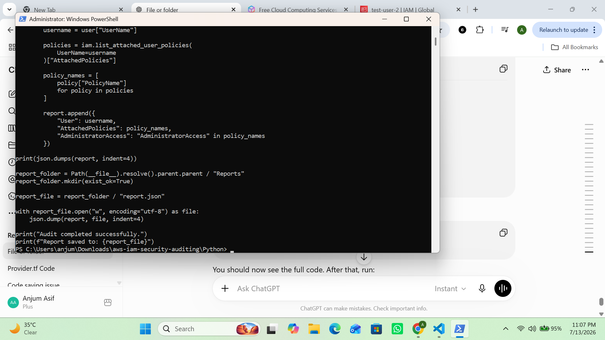
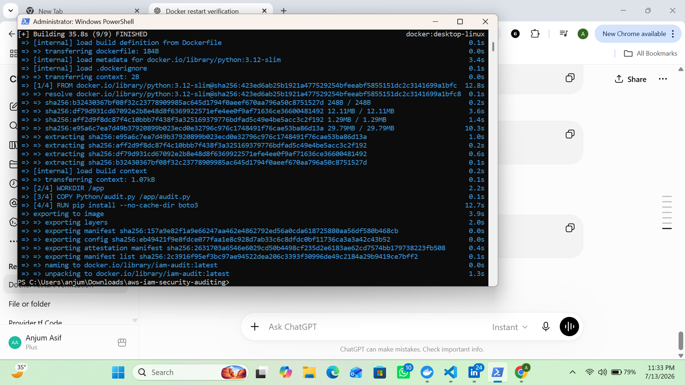

# AWS IAM Security Monitoring & Auditing

A small toolkit for provisioning test IAM identities with Terraform and auditing their permissions with a Python/boto3 script — packaged to run locally or in Docker.

## What it does

1. **Terraform** provisions a set of IAM users and policy attachments in an AWS account (used here as a sandbox to generate realistic audit targets — e.g. a user with `AdministratorAccess` and one with only `ReadOnlyAccess`).
2. **`audit.py`** connects to AWS via boto3, lists every IAM user, pulls each user's attached managed policies, and flags whether the user has `AdministratorAccess`.
3. The script writes the findings to `Reports/report.json` and also prints them to stdout.

## Technologies Used

- AWS IAM
- Terraform
- Python 3
- boto3
- Docker
- AWS CLI
- VS Code
- Git & GitHub

## Key Features

- Provisioned IAM users using Terraform
- Automated IAM security auditing using Python (boto3)
- Identified users with AdministratorAccess permissions
- Generated JSON audit reports
- Containerized the audit tool with Docker
- Automated infrastructure deployment and cleanup

## Project structure

```
aws-iam-security-auditing/
├── Terraform/
│   ├── provider.tf        # AWS provider + required Terraform version
│   ├── variables.tf       # aws_region variable (default: us-east-1)
│   ├── main.tf            # IAM users + policy attachments (test fixtures)
│   ├── iam_roles.tf       # reserved for IAM role resources
│   ├── iam_policies.tf    # reserved for custom policy resources
│   ├── outputs.tf         # reserved for Terraform outputs
│   └── .terraform.lock.hcl
├── Python/
│   ├── audit.py           # main audit script
│   ├── requirements.txt   # Python dependencies (boto3)
│   └── Dockerfile         # containerizes audit.py using requirements.txt
├── Dockerfile             # simpler root-level image (installs boto3 directly)
├── Reports/
│   └── report.json        # generated after each audit run
└── .gitignore
```

## Prerequisites

- An AWS account and credentials with permission to manage IAM (`iam:CreateUser`, `iam:AttachUserPolicy`, `iam:ListUsers`, `iam:ListAttachedUserPolicies`, etc.)
- [Terraform](https://developer.hashicorp.com/terraform/downloads) >= 1.5.0
- Python 3.12 (or Docker, if you don't want a local Python install)
- AWS credentials configured via `aws configure`, environment variables, or an IAM role — **never hardcode keys in the code or terminal history**

## Setup: provision the test IAM users

```bash
cd Terraform
terraform init
terraform apply
```

This creates the IAM users/policy attachments defined in `main.tf`. Review the plan before confirming `apply`, since this modifies real IAM resources in your AWS account.

To tear everything down afterward:

```bash
terraform destroy
```

## Running the audit

### Option A — locally with Python

```bash
cd Python
pip install -r requirements.txt
python audit.py
```

### Option B — with Docker

From the project root (uses the root `Dockerfile`, which installs `boto3` directly):

```bash
docker build -t iam-audit .
docker run --rm \
  -e AWS_ACCESS_KEY_ID=<your-key> \
  -e AWS_SECRET_ACCESS_KEY=<your-secret> \
  -e AWS_DEFAULT_REGION=us-east-1 \
  iam-audit
```

Prefer mounting a local AWS credentials file or using an instance/role profile over passing keys as environment variables where possible.

Either way, the script prints a JSON summary and writes it to `Reports/report.json`, e.g.:

```json
[
    {
        "User": "test-user-1",
        "AttachedPolicies": ["AdministratorAccess"],
        "AdministratorAccess": true
    },
    {
        "User": "test-user-2",
        "AttachedPolicies": ["ReadOnlyAccess"],
        "AdministratorAccess": false
    }
]
```

## Troubleshooting

- Resolved Terraform configuration and state issues during IAM resource provisioning.
- Fixed AWS credential and region configuration errors for Terraform and Python (boto3).
- Troubleshot Python script execution by verifying IAM permissions and API responses.
- Resolved Docker Desktop daemon startup and container runtime issues on Windows.
- Corrected file path, folder structure, and module import issues in VS Code.
- Verified audit report generation by testing multiple IAM users, roles, and policies.
- Validated Terraform deployment and cleanup using `terraform apply` and `terraform destroy`.

## Lessons learned

- Gained practical experience provisioning AWS IAM resources using Terraform.
- Automated IAM security auditing using Python and the AWS SDK (boto3).
- Strengthened understanding of IAM security best practices, including least privilege, MFA, and avoiding wildcard permissions.
- Learned to configure AWS credentials securely for automation workflows.
- Containerized Python applications with Docker for portable and consistent execution.
- Improved troubleshooting skills across Terraform, Docker, Python, AWS IAM, and local development environments.
- Experienced the complete cloud project lifecycle, including provisioning, auditing, report generation, containerization, documentation, GitHub version control, and infrastructure cleanup.

## Future Enhancements

- Detect users without MFA enabled
- Identify inactive access keys
- Detect wildcard IAM permissions
- Generate HTML and CSV audit reports
- Send audit reports through Amazon SNS or email notifications
- Integrate CloudWatch logging
- Build CI/CD pipeline using GitHub Actions

## Security notes

- Treat `Reports/report.json` as sensitive — it lists real IAM users and their privilege level. Avoid committing generated reports from real accounts to a public repo.
- Never commit AWS access keys, `.tfstate` files, or `.terraform/` directories (see `.gitignore`).
- The Terraform fixtures intentionally create an over-privileged user (`AdministratorAccess`) for testing purposes — don't reuse this pattern for real production users.

## Screenshots

**Project structure**


**Terraform apply**


**IAM users created**


**AdministratorAccess identified**


**Test users audit results**


**Audit results**


**Generated audit report**


**Docker build success**

